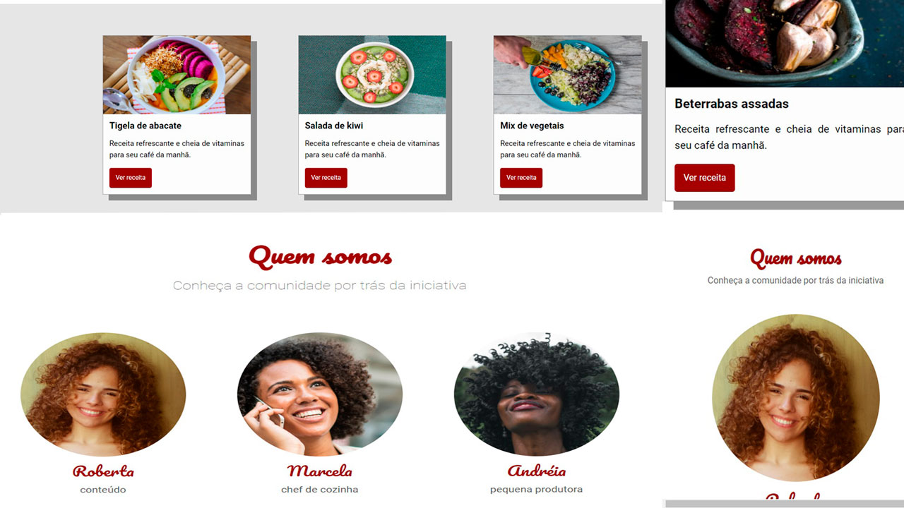

<h1 align="center"> Receitas Fitness </h1>

  

## 🚀 Tecnologias

Esse projeto foi desenvolvido com as seguintes tecnologias:

- HTML e CSS
- Figma
- Git e Github

## 💻 Projeto

O Receitas Fitness é uma página de receitas criada com a finalidade de praticar responsividade e acessibilidade em todos os aparelhos além de utilizar técnicas de  arquitetura CSS fazendo uso da estrategia BEM(Block, Element , Modifier).

- [Acesse o projeto finalizado, online](https://ramonwordads.github.io/receitasFit)
